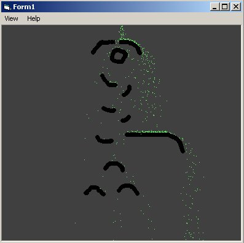



## Primitive Dynamic particle system

### Description

This particle system will dynamically adapt to the environment you give

it, bouncing off boundries and borders. Draw a wall and particles will

have to bounce off it or avoid it somehow. Gravity is the dominating

force in this one. Must be seen in motion!

Note: all 'vbblack' (&H000000) pixels force the particles to be blocked

which is how the engine tells where borders are.

use the mouse to draw borders and guide the particles
 
### More Info
 

             |
---                |---
**Submitted On**   |2002-12-24 14:15:30
**By**             |[Tecc](https://github.com/Planet-Source-Code/PSCIndex/blob/master/ByAuthor/tecc.md)
**Level**          |Advanced
**User Rating**    |4.8 (53 globes from 11 users)
**Compatibility**  |VB 6\.0
**Category**       |[Graphics](https://github.com/Planet-Source-Code/PSCIndex/blob/master/ByCategory/graphics__1-46.md)
**World**          |[Visual Basic](https://github.com/Planet-Source-Code/PSCIndex/blob/master/ByWorld/visual-basic.md)
**Archive File**   |[Primitive\_15179912242002\.zip](https://github.com/Planet-Source-Code/tecc-primitive-dynamic-particle-system__1-41833/archive/master.zip)

